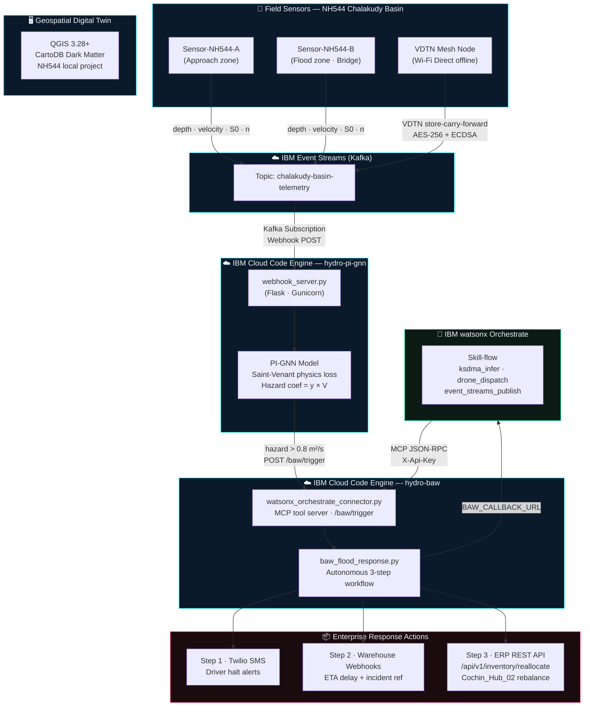

# Hydro-Kinematic Logistics Mesh & Digital Twin

A next-generation enterprise logistics architecture designed to maintain continuous supply chain visibility and rerouting capabilities during catastrophic infrastructural failures.

## 🌟 The Problem
During extreme weather events (e.g., unpredicted cloudbursts and flash floods), conventional routing engines fail because they lack physical context, and cellular grid outages sever IoT telemetry.

## 🚀 The Solution
This proof-of-concept leverages **Physics-Informed Neural Networks (PI-GNN)** combined with **Vehicular Delay-Tolerant Networking (VDTN)** to calculate localized fluid dynamics and securely broadcast that intelligence offline between vehicles. It is orchestrated natively using IBM's enterprise ecosystem.

---

## 🏗️ Architecture Stack

### 1. Physics-Informed Graph Neural Network (PI-GNN)
A PyTorch-based routing engine that penalizes predictions violating the **1D Saint-Venant equations** (mass/momentum conservation). It computes a localized **Kinematic Hazard Coefficient** ($y \times V$). If the coefficient exceeds $0.8 \text{ m}^2\text{/s}$, the edge is flagged as a critical failure. The model weights are seeded deterministically (`DEMO_SEED=1`, 2 000 Adam steps) for reproducible demo outputs; replace with `load_state_dict()` for a fully-trained model.

### 2. Vehicular Delay-Tolerant Networking (VDTN)
When cellular infrastructure drops (simulated in our dead zone), the edge nodes dynamically switch to a "store-carry-and-forward" Wi-Fi Direct protocol. Telemetry is secured using **AES-256 encryption** and authenticated via **ECDSA digital signatures**.

### 3. Serverless IBM Infrastructure & Agentic Orchestration
*   **IBM Event Streams (Kafka)**: Decouples chaotic, burst-heavy telemetry from the fleet.
*   **IBM Cloud Code Engine**: Provisions serverless containers to run PI-GNN inference dynamically.
*   **IBM Bob (MCP Integration)**: Automates enterprise ERP responses via **watsonx**, including drone dispatching and inventory reallocation triggers.

### 4. Geospatial Digital Twin
A verifiable local **QGIS** project utilizing CartoDB Dark Matter basemaps. It visually simulates the NH544 corridor, cloudburst hydrodynamics, cellular disruptions, and VDTN offline rerouting.

### 5. Business Automation Layer *(new)*
Three new components implement the fully autonomous enterprise response pipeline:

| Component | File | Role |
|-----------|------|------|
| **Code Engine Webhook Server** | `pi-gnn/webhook_server.py` | Receives IBM Event Streams subscription webhooks, runs PI-GNN inference, fires BAW on critical events |
| **watsonx Orchestrate MCP Connector** | `baw/watsonx_orchestrate_connector.py` | Exposes `ksdma_infer`, `event_streams_publish`, and `event_streams_latest_offset` as discoverable MCP tools; hosts `/baw/trigger` endpoint |
| **Autonomous BAW Workflow** | `baw/baw_flood_response.py` | Executes SMS dispatch → warehouse notification → ERP rebalance with zero human intervention |

---

## 🗺️ System Architecture



---

## 💻 Getting Started

### 1. Generate QGIS Digital Twin Data
```bash
python3 qgis-demo/generate_qgis_data.py
```
*Generates scenario GeoJSON data. Next, open QGIS and run `qgis-demo/build_qgis_project.py` in the Python console to build the interactive `.qgz` project.*

### 2. Run the Backend & Security Physics Engine
```bash
cd pi-gnn
pip install -r requirements.txt
# Run the PI-GNN & IBM Event Streams Mock
python3 model.py
# Run the Offline Cryptographic VDTN Simulation
python3 vdtn_simulation.py
```

### 3. Containerization — IBM Cloud Code Engine

Two containers are deployed: the **PI-GNN inference service** and the **BAW / MCP connector**.

```bash
# Build and push the PI-GNN inference image
cd pi-gnn
docker build -t hydro-pi-gnn .
docker tag hydro-pi-gnn icr.io/<namespace>/hydro-pi-gnn:latest
docker push icr.io/<namespace>/hydro-pi-gnn:latest

# Build and push the BAW / MCP connector image
cd ../baw
docker build -t hydro-baw .
docker tag hydro-baw icr.io/<namespace>/hydro-baw:latest
docker push icr.io/<namespace>/hydro-baw:latest
```

**Code Engine App configuration (PI-GNN):**
```bash
ibmcloud ce app create \
  --name hydro-pi-gnn \
  --image icr.io/<namespace>/hydro-pi-gnn:latest \
  --min-scale 0 --max-scale 10 \
  --env BAW_ENDPOINT=https://hydro-baw.<region>.codeengine.appdomain.cloud/baw/trigger
```

**Code Engine App configuration (BAW):**
```bash
ibmcloud ce app create \
  --name hydro-baw \
  --image icr.io/<namespace>/hydro-baw:latest \
  --min-scale 0 --max-scale 5 \
  --env-from-secret hydro-baw-secrets
```

**Create the secrets bundle:**
```bash
ibmcloud ce secret create --name hydro-baw-secrets \
  --from-literal TWILIO_ACCOUNT_SID=<sid> \
  --from-literal TWILIO_AUTH_TOKEN=<token> \
  --from-literal TWILIO_FROM_NUMBER=<e164_number> \
  --from-literal ERP_BASE_URL=https://erp.your-org.internal \
  --from-literal ERP_API_KEY=<erp_key> \
  --from-literal MCP_API_KEY=<mcp_secret> \
  --from-literal DRIVER_PHONE_NUMBERS=+9199XXXXXXXX,+9188XXXXXXXX \
  --from-literal WAREHOUSE_WEBHOOK_URLS=https://wh1.example.com/alert,https://wh2.example.com/alert
```

**Attach IBM Event Streams as a subscription trigger:**
```bash
ibmcloud ce subscription kafka create \
  --name nh544-telemetry-sub \
  --destination hydro-pi-gnn \
  --destination-type app \
  --topic chalakudy-basin-telemetry \
  --brokers <kafka_broker_list> \
  --consumer-group hydro-pi-gnn-cg
```

### 4. Run the BAW Demo (standalone)
```bash
cd baw
pip install -r requirements.txt
python3 baw_flood_response.py
```
*Runs a full autonomous workflow in demo mode — no credentials required.*

### 5. Run the MCP Connector Server (local dev)
```bash
cd baw
MCP_API_KEY=dev-insecure-key python3 watsonx_orchestrate_connector.py
# Discovers tools at: GET http://localhost:9090/mcp/tools/list
# Trigger BAW manually: POST http://localhost:9090/baw/trigger
```

---

## 🔄 End-to-End Autonomous Flow

```
Flood Sensor → IBM Event Streams (Kafka)
    │
    │  Kafka Subscription Webhook
    ▼
IBM Cloud Code Engine App [hydro-pi-gnn]
  webhook_server.py  →  model.py (PI-GNN inference)
    │
    │  hazard > 0.8 m²/s  →  POST /baw/trigger (fire-and-forget thread)
    ▼
IBM Cloud Code Engine App [hydro-baw]
  watsonx_orchestrate_connector.py
    │
    ├─► baw_flood_response.py  Step 1: Twilio SMS → Drivers (halt at elevated rest area)
    ├─► baw_flood_response.py  Step 2: Webhook → FMCG Warehouses (ETA delay + incident ref)
    └─► baw_flood_response.py  Step 3: ERP API /api/v1/inventory/reallocate (Cochin_Hub_02)
    │
    └─► BAW_CALLBACK_URL (optional — watsonx Orchestrate dashboard / audit log)
```

---

## 📁 Repository Structure

```
.
├── .bob/
│   └── mcp.json                        # MCP server registry (Bob + watsonx Orchestrate)
├── pi-gnn/
│   ├── Dockerfile                      # Optimised multi-stage Code Engine image
│   ├── model.py                        # PI-GNN + Saint-Venant physics loss
│   ├── vdtn_simulation.py              # Offline VDTN mesh simulation
│   ├── webhook_server.py               # Flask app — Event Streams webhook receiver
│   └── requirements.txt
├── baw/
│   ├── Dockerfile                      # Code Engine image for BAW + MCP connector
│   ├── watsonx_orchestrate_connector.py # MCP tool server + /baw/trigger endpoint
│   ├── baw_flood_response.py           # Autonomous 3-step BAW workflow
│   └── requirements.txt
└── qgis-demo/                          # QGIS project generator and scenario data
```
